<div align="center">

<!-- DYNAMIC SVG HERO BANNER (DARK & LIGHT COMPATIBLE) -->
<picture>
  <source media="(prefers-color-scheme: dark)" srcset="assets/banner-dark.svg">
  <source media="(prefers-color-scheme: light)" srcset="assets/banner-light.svg">
  
</picture>

<br/><br/>

<!-- TYPING SVG BADGE -->
<a href="https://github.com/safayvs">
  
</a>

<br/>

<!-- BADGES & SOCIAL LINKS -->
<p align="center">
  <a href="https://github.com/safayvs">
    
  </a>
  <a href="https://github.com/safayvs?tab=repositories&sort=stargazers">
    
  </a>
  <a href="https://linkedin.com">
    
  </a>
  <a href="https://github.com/safayvs/safayvs">
    
  </a>
</p>

</div>

---

### 👨‍💻 Executive Summary

I am a **Software Engineer** specializing in high-throughput **Full Stack Applications**, **AI-Assisted Development**, and robust **Software Architecture**. Focused on crafting high-performance digital products, automating complex workflows, and deploying clean, resilient codebases.

```typescript
interface SoftwareEngineer {
  name: "Safa Yavaş";
  role: "Software Engineer & Full Stack Architect";
  coreFocus: ["Full Stack Development", "AI Assisted Systems", "Software Architecture", "Automation"];
  philosophy: "Build products, not demos. Clean Architecture first.";
  status: "Designing Next-Gen Platforms";
}
```

---

### 💡 Development Philosophy

<table>
  <tr>
    <td width="50%" valign="top">
      <h4>⚡ Products, Not Demos</h4>
      <p>Focused on production-ready systems, offline support, resilience, and real-world utility over non-scalable prototypes.</p>
    </td>
    <td width="50%" valign="top">
      <h4>🏗️ Clean Architecture First</h4>
      <p>Decoupled modules, strict type safety, predictable state management, and enterprise-grade maintainability.</p>
    </td>
  </tr>
  <tr>
    <td width="50%" valign="top">
      <h4>⚙️ Automation First</h4>
      <p>Eliminating redundant operational friction through CI/CD pipelines, automated testing, and background workers.</p>
    </td>
    <td width="50%" valign="top">
      <h4>🚀 Performance & UX Precision</h4>
      <p>Sub-100ms response targets, glassmorphic modern UI design, seamless responsiveness, and pixel-perfect ergonomics.</p>
    </td>
  </tr>
</table>

---

### 🚀 Featured Projects

<table width="100%">
  <!-- PROJECT 1: HASILAT TUT -->
  <tr>
    <td width="50%" valign="top">
      <h3 align="center">📊 HASILAT TUT</h3>
      <p align="center"><b>Production-Ready Revenue Tracking Platform</b></p>
      <p>High-reliability financial &amp; revenue tracking PWA built for offline resilience, real-time analytics, and instant cloud sync.</p>
      <p align="center">
        <code>PWA</code> • <code>Supabase</code> • <code>Cloudflare</code> • <code>Docker</code> • <code>Offline Support</code>
      </p>
      <ul>
        <li>⚡ Progressive Web App with offline-first indexing</li>
        <li>🔐 Role-based authentication &amp; encrypted database access</li>
        <li>📈 Interactive dashboard &amp; instant modular reports</li>
      </ul>
    </td>
    
  <!-- PROJECT 2: STOCKER -->
    <td width="50%" valign="top">
      <h3 align="center">📦 Stocker</h3>
      <p align="center"><b>Modern Inventory &amp; Stock Management</b></p>
      <p>Cloud-ready stock and supply chain control engine featuring real-time reporting, automated re-stock alerts, and responsive UI.</p>
      <p align="center">
        <code>Inventory</code> • <code>Reports</code> • <code>Analytics</code> • <code>Dashboard</code> • <code>Cloud Ready</code>
      </p>
      <ul>
        <li>📊 Multi-warehouse inventory flow tracking</li>
        <li>⚡ Real-time stock audit logging &amp; telemetry analytics</li>
        <li>📱 Glassmorphic, ultra-responsive dashboard interface</li>
      </ul>
    </td>
  </tr>

  <!-- PROJECT 3: TELEGRAM BOT -->
  <tr>
    <td width="50%" valign="top">
      <h3 align="center">🤖 Telegram Bot Platform</h3>
      <p align="center"><b>High-Throughput Automation System</b></p>
      <p>Asynchronous event-driven bot platform for automated notifications, background task processing, and PostgreSQL integration.</p>
      <p align="center">
        <code>Telegram API</code> • <code>Supabase</code> • <code>PostgreSQL</code> • <code>Automation</code>
      </p>
      <ul>
        <li>🔔 Real-time multi-channel automated broadcast queue</li>
        <li>⚡ Serverless background cron execution</li>
        <li>🛡️ Secure database persistence &amp; service layer</li>
      </ul>
    </td>

  <!-- PROJECT 4: ADET TAKIP -->
    <td width="50%" valign="top">
      <h3 align="center">🌸 Adet Takip</h3>
      <p align="center"><b>Modern Women's Health Application</b></p>
      <p>Privacy-focused health tracking software with cycle prediction algorithms, interactive calendar metrics, and ergonomic UX.</p>
      <p align="center">
        <code>Cycle Tracking</code> • <code>Statistics</code> • <code>Prediction</code> • <code>Modern UX</code>
      </p>
      <ul>
        <li>📅 Interactive visual calendar &amp; cycle phase prediction</li>
        <li>🔒 Local data encryption &amp; privacy-first architecture</li>
        <li>✨ Fluid micro-animations &amp; intuitive design</li>
      </ul>
    </td>
  </tr>
</table>

---

### 🛠️ Tech Stack & Ecosystem

<p align="center">
  
</p>

```
┌─────────────────────────┬──────────────────────────────────────────────────────────┐
│ Category                │ Technologies                                             │
├─────────────────────────┼──────────────────────────────────────────────────────────┤
│ Core & Frontend         │ React, Next.js 14, TypeScript, Tailwind CSS, HTML5, PWA  │
│ Backend & Databases     │ Node.js, Python, PostgreSQL, Supabase, REST APIs, GraphQL│
│ Cloud & DevOps          │ Docker, Cloudflare, GitHub Actions, Linux, Serverless    │
│ Architecture & Design   │ Clean Architecture, System Design, Figma, Automation     │
└─────────────────────────┴──────────────────────────────────────────────────────────┘
```

---

### 🔄 Development Workflow

```mermaid
graph LR
    A[💡 Architecture & Requirements] --> B[🎨 UI/UX & Schema Specs]
    B --> C[⚙️ Clean Modular Implementation]
    C --> D[🧪 Automated CI/CD & Security Check]
    D --> E[🚀 Cloudflare & Docker Deployment]
    E --> F[📊 Real-Time Analytics & Iteration]

    style A fill:#0F172A,stroke:#7C3AED,stroke-width:2px,color:#F8FAFC
    style B fill:#0F172A,stroke:#22D3EE,stroke-width:2px,color:#F8FAFC
    style C fill:#0F172A,stroke:#10B981,stroke-width:2px,color:#F8FAFC
    style D fill:#0F172A,stroke:#F59E0B,stroke-width:2px,color:#F8FAFC
    style E fill:#0F172A,stroke:#7C3AED,stroke-width:2px,color:#F8FAFC
    style F fill:#0F172A,stroke:#22D3EE,stroke-width:2px,color:#F8FAFC
```



---

### 📊 GitHub Telemetry & Stats

<div align="center">

<table width="100%">
  <tr>
    <td width="50%">
      
    </td>
    <td width="50%">
      
    </td>
  </tr>
</table>

<!-- STREAK STATS -->
<br/>


</div>

---

### 🐍 Contribution Activity Matrix

<div align="center">
  <picture>
    <source media="(prefers-color-scheme: dark)" srcset="https://raw.githubusercontent.com/safayvs/safayvs/output/github-contribution-grid-snake-dark.svg">
    <source media="(prefers-color-scheme: light)" srcset="https://raw.githubusercontent.com/safayvs/safayvs/output/github-contribution-grid-snake.svg">
    
  </picture>
</div>

---

### 🎯 Goals & Roadmap

- [x] **HASILAT TUT**: Complete offline PWA sync layer and automated reporting engine.
- [x] **Stocker**: Deploy cloud inventory telemetry dashboard.
- [ ] **AI System Integration**: Expand automated AI agents into web workflows.
- [ ] **Open Source Contributions**: Publish modular clean architecture templates for Next.js & Supabase.

---

<div align="center">

<p fill="#94A3B8">
  Designed &amp; Engineered with precision by <b>Safa Yavaş</b> • © 2026
</p>

</div>
